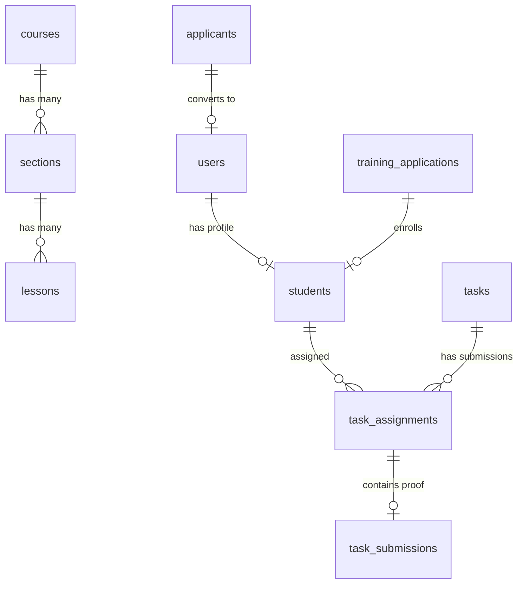

# 🎓 OmniLearn LMS — Enterprise Learning Management & SaaS Platform

[](https://nodejs.org/)
[](https://expressjs.com/)
[](https://nextjs.org/)
[](https://react.dev/)
[](https://www.typescriptlang.org/)
[](https://supabase.com/)
[](https://omnilearn-lms.onrender.com)
[](#)

> **OmniLearn LMS** is a full-featured, enterprise-grade Learning Management System & Training Automation Platform designed for academies, bootcamps, institutes, and corporate training providers. It features a complete student enrollment pipeline, interactive course builder, student portal, proof-of-work task submission system, admin grading suite, automated email engine, and cloud image hosting.

---

## 🌐 Live Production Links

* **🚀 Backend REST API (Render):** [`https://omnilearn-lms.onrender.com`](https://omnilearn-lms.onrender.com)
* **⚡ Frontend Application (Vercel):** Optimized Next.js 16 App Router deployment target on Vercel.
* **🗄️ Database Infrastructure:** PostgreSQL hosted on Supabase Cloud.

---

## 🚀 Product Overview & Value Proposition

**OmniLearn LMS** is built as a white-label, commercial SaaS product ready to sell to client organizations. It bridges the gap between public course applications, interactive learning, assignment submissions, and student evaluation.

### Key Highlights for Clients & Organizations:
* 💎 **End-to-End Student Journey:** From initial public registration form to account approval, course access, task submission, and graduation scoring.
* 📧 **Automated SMTP Email System:** Sends personalized HTML acceptance and rejection emails with custom admin notes to applicants.
* 🖼️ **Zero-Cost Storage Engine:** Uses GitHub Contents API for direct image uploads (course thumbnails & student proof screenshots) stored safely without third-party storage fees (S3).
* 🛡️ **Robust Security & Roles:** JWT authentication with Bcrypt password hashing, enforcing strict Admin and Student role separations.
* 📊 **Live Analytics & Progress Tracking:** Real-time metrics for both administrators and students.

---

## 📦 Core Modules & Working Features

### 1. 📚 Interactive Course Builder Module (`/courses`)
* **Step-by-Step Wizard:** Create courses effortlessly through basic details, section structure, lesson additions, thumbnail uploads, and pricing.
* **Curriculum Management:** Hierarchical hierarchy (`Course -> Sections -> Lessons`).
* **Bulk Curriculum Import:** CSV/Text parser for importing entire course outlines in seconds.
* **Lesson Metadata:** Support for video/media links, hands-on tasks, project milestones, tech stack tags, and difficulty badges (Beginner, Intermediate, Advanced).
* **Course Catalog:** Filtering, search, publishing controls (`draft` vs `published`), and price settings.

### 2. 📝 Public Training Application System (`/apply`)
* **Public Form:** Captures student details including Full Name, Father Name, CNIC, Age, WhatsApp, Gmail, University, Department, Semester, Track preferences, and Reference Code.
* **Account Auto-Creation Option:** Allows applicants to create a student portal login while applying.
* **Duplicate Prevention:** Strict database-level checks on CNIC and Gmail to eliminate duplicate applications.

### 3. 👥 Applicants Review & Automated Enrollment (`/students/applicants`)
* **Admin Review Dashboard:** View, filter, and inspect pending student applications.
* **One-Click Approval:**
  * Auto-generates unique Student Enrollment ID (e.g., `ENR-839210-4`).
  * Creates `User` authentication account and `Student` registry record.
  * Auto-triggers **Personalized HTML Acceptance Email** via SMTP featuring track tags and custom admin comments.
* **One-Click Rejection:** Auto-triggers encouraging HTML rejection email with optional admin guidance.

### 4. ⚡ Task & Proof-of-Work Submission Engine (`/tasks`, `/student/tasks`)
* **Admin Task Distribution (`/tasks/new`):**
  * Create rich assignments with title, description, points (0–100), due date, course label, and reference links.
  * Assign tasks to specific students or batch-assign to all students in a track.
* **Student Proof-of-Work Submission (`/student/submit-task`):**
  * Students submit proof including GitHub Repository URL, Live Demo URL, Video walkthrough URL, text notes, and drag-and-drop screenshot uploads.
  * Real-time status update (`pending` ➔ `completed` ➔ `marked`).

### 5. 🎯 Admin Evaluation & Grading Portal (`/tasks/review`, `/tasks/completed`)
* **Review Interface:** Dedicated interface for admins to view student code repos, live web apps, preview uploaded screenshots, and read student notes.
* **Grading Engine:** Score submissions from 0 to 100 with detailed feedback comments.
* **Historical Performance:** View past task scores and submission timestamps per student.

### 6. 🎓 Student Dashboard & Profile (`/student/dashboard`, `/student/profile`)
* **Student Dashboard:** Real-time statistics showing Total Tasks, Completed Tasks, Graded Tasks, Pending Tasks, and Average Score.
* **Profile Center:** Manage personal details, WhatsApp contact, university background, avatar image, LinkedIn, GitHub, Portfolio, and Resume links.
* **Smart Auto-Fill:** Auto-populates missing profile fields directly from the original application record.

### 7. 🖼️ Cloud Image Upload Engine (`/api/upload`)
* Custom drag-and-drop file uploader component with base64 conversion.
* Server uploads images to the GitHub repository's `images/` directory via GitHub API.
* Instant generation of CDN raw URLs (`https://raw.githubusercontent.com/...`) for thumbnails and proof attachments.

---

## 🛠️ Technology Stack

| Layer | Technology | Usage |
| :--- | :--- | :--- |
| **Frontend** | **Next.js 16 (App Router)** | Full-stack SSR/SSG React framework |
| **UI & Styling** | **Tailwind CSS v4 + Lucide Icons** | Modern responsive dark/light UI design system |
| **Client Toast** | **React Toastify** | Instant feedback notifications |
| **Backend API** | **Express 5 (Node.js)** | High-performance RESTful API service |
| **Language** | **TypeScript 5/6** | End-to-end static typing safety |
| **Database** | **Supabase PostgreSQL (`pg`)** | Relational cloud database with connection pooling |
| **Authentication** | **JWT + Bcrypt.js** | Secure 24-hour JSON Web Tokens & salted password hashing |
| **Email Engine** | **Nodemailer + Gmail SMTP** | Transactional HTML emails with responsive templates |
| **Image Hosting** | **GitHub Contents API** | Direct repository-backed image CDN |
| **Hosting (Server)** | **Render** | Docker/Node container live hosting |
| **Hosting (Client)** | **Vercel** | Global edge distribution |

---

## 🗄️ Database Architecture & Schemas

The database schema auto-initializes and auto-migrates columns on server boot (`server/src/db_init.ts` & `server/src/index.ts`).



### Table Overview:
1. `courses` — Course details, category, thumbnail URL, price, and status (`draft`/`published`).
2. `sections` — Course sections with ordering.
3. `lessons` — Lessons inside sections with duration, media URL, milestone, and difficulty.
4. `users` — Authentication credentials (`email`, `password_hash`, `role`).
5. `applicants` — General inquiry applications.
6. `students` — Registered student profile, enrollment ID, program, contacts, and social links.
7. `training_applications` — Multi-track training applications submitted via `/apply`.
8. `tasks` — Admin created assignments with points, due date, and reference links.
9. `task_assignments` — Links tasks to students with status (`pending`, `completed`, `marked`), score, and feedback.
10. `task_submissions` — Student proof of work (GitHub URL, live URL, screenshots, notes).

---

## 📡 REST API Endpoints Reference

### 🔓 System & Auth
| Method | Endpoint | Description |
| :--- | :--- | :--- |
| `GET` | `/` | API Root Health Check |
| `GET` | `/api/health` | System status & database connection check |
| `POST` | `/api/auth/login` | User login (returns JWT token and user info) |

### 📚 Course Builder
| Method | Endpoint | Description |
| :--- | :--- | :--- |
| `GET` | `/api/courses` | Fetch all courses with section/lesson counts |
| `GET` | `/api/courses/:id` | Fetch single course with nested sections & lessons |
| `POST` | `/api/courses` | Create new course draft |
| `PUT` | `/api/courses/:id` | Update course details |
| `POST` | `/api/courses/:id/publish` | Publish course with price |
| `POST` | `/api/courses/:id/sections` | Add section to course |
| `PUT` | `/api/sections/:id` | Update section title / order |
| `DELETE` | `/api/sections/:id` | Delete section |
| `POST` | `/api/sections/:sectionId/lessons` | Add lesson to section |
| `PUT` | `/api/lessons/:id` | Update lesson details |
| `DELETE` | `/api/lessons/:id` | Delete lesson |
| `POST` | `/api/courses/:id/bulk-curriculum` | Replace & bulk save entire curriculum |

### 📝 Applications & Students
| Method | Endpoint | Description |
| :--- | :--- | :--- |
| `POST` | `/api/training-applications` | Submit public training application (`/apply`) |
| `GET` | `/api/training-applications` | Get pending training applications |
| `GET` | `/api/training-applications/count` | Pending application count badge |
| `POST` | `/api/training-applications/:id/approve` | Approve applicant, create student user, send email |
| `POST` | `/api/training-applications/:id/reject` | Reject application & send email |
| `GET` | `/api/students` | Get all registered students roster |
| `GET` | `/api/students/profile?userId=X` | Get student profile |
| `PUT` | `/api/students/profile` | Update student profile & social links |
| `GET` | `/api/students/:studentId/dashboard-stats` | Get student completion statistics |

### ⚡ Tasks & Submissions
| Method | Endpoint | Description |
| :--- | :--- | :--- |
| `GET` | `/api/tasks` | Get all tasks |
| `POST` | `/api/tasks` | Create task and assign to students |
| `GET` | `/api/students/:studentId/tasks` | Get tasks assigned to a student |
| `GET` | `/api/tasks/assignments/by-course/:courseId` | Get task assignments for a course |
| `GET` | `/api/tasks/assignments/:assignmentId` | Get single assignment & student submission |
| `POST` | `/api/tasks/assignments/:assignmentId/submit` | Submit proof of work (GitHub, Live URL, Images) |
| `POST` | `/api/tasks/assignments/:assignmentId/grade` | Grade submission (score 0-100 & feedback) |

### 🖼️ Utilities
| Method | Endpoint | Description |
| :--- | :--- | :--- |
| `POST` | `/api/upload` | Upload base64 image to GitHub & return CDN URL |

---

## 💻 Local Installation & Setup Guide

### Prerequisites
* **Node.js**: v18.x or v20.x
* **npm**: v9.x or higher
* **PostgreSQL Database**: Supabase account or local PostgreSQL instance

### 1. Repository Setup
```bash
git clone https://github.com/UmarAjmal/OmniLearn.LMS.git
cd OmniLearn.LMS
```

### 2. Backend Server Setup
```bash
cd server
npm install
```

Create a `.env` file in `server/.env`:
```env
PORT=5000
DB_HOST=aws-1-ap-southeast-2.pooler.supabase.com
DB_NAME=postgres
DB_PASSWORD=your_db_password
DB_PORT=5432
DB_USER=postgres.your_db_user

# JWT Authentication
JWT_SECRET=your_super_secret_jwt_key

# Email (SMTP) Configuration
SMTP_HOST=smtp.gmail.com
SMTP_PORT=587
SMTP_USER=your_admin_email@gmail.com
SMTP_PASS=your_gmail_app_password
ADMIN_EMAIL=your_admin_email@gmail.com

# GitHub Image Upload Token
GITHUB_TOKEN=your_github_personal_access_token
```

Initialize DB & Start Server:
```bash
# Initialize DB Schema
npx tsx src/db_init.ts

# Run in Development Mode
npm run dev
```
*Server will start at `http://localhost:5000`*

### 3. Frontend Client Setup
```bash
cd ../client
npm install
```

Create a `.env.local` file in `client/.env.local`:
```env
NEXT_PUBLIC_SUPABASE_URL=https://your-supabase-ref.supabase.co
NEXT_PUBLIC_SUPABASE_ANON_KEY=your_supabase_anon_key
NEXT_PUBLIC_API_URL=http://localhost:5000
```

Start Next.js App:
```bash
npm run dev
```
*Client will start at `http://localhost:3000`*

---

## ☁️ Deployment Guide

### Deploying Backend to Render
1. Create a new **Web Service** on [Render](https://render.com).
2. Connect your GitHub repository `OmniLearn.LMS` and select the `server` root directory.
3. Configuration:
   * **Build Command:** `npm install --include=dev && tsc`
   * **Start Command:** `node dist/index.js`
4. Add all environment variables from `server/.env` to Render Environment settings.
5. Set `PORT=5000`.

### Deploying Frontend to Vercel
1. Import `OmniLearn.LMS` into [Vercel](https://vercel.com).
2. Set Root Directory to `client`.
3. Add Environment Variable:
   * `NEXT_PUBLIC_API_URL` = `https://omnilearn-lms.onrender.com`
4. Deploy!

---

## 💼 Commercial Licensing & Client Customization

**OmniLearn LMS** is built with custom white-label capabilities for re-sale to clients:
* **Custom Branding:** Easily modify brand logos, primary color accents in `client/app/globals.css`, and navigation headers.
* **Email Templates:** Custom HTML transactional emails can be customized with client logos, social links, and institution branding.
* **Multi-Domain Ready:** Deploy separate isolated frontend/backend instances per client.

---

## 👨‍💻 Developer & Product Owner

Developed and maintained by **Umar Ajmal** as a flagship SaaS & LMS Product.

For client deployment inquiries, white-label customization, or feature additions, contact via the project repository.