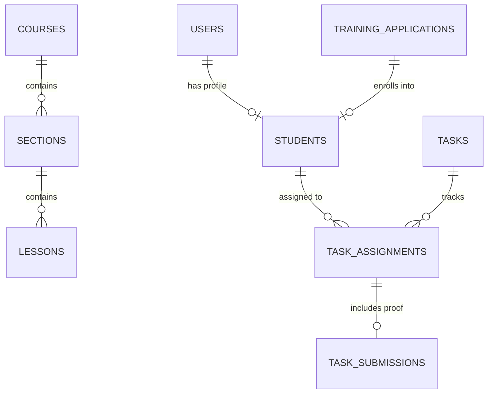

# 🎓 OmniLearn LMS — Enterprise Learning Management & SaaS Platform

[](https://omni-learn-lms.vercel.app)
[](https://omnilearn-lms.onrender.com)
[](https://nextjs.org/)
[](https://react.dev/)
[](https://expressjs.com/)
[](https://supabase.com/)
[](https://www.typescriptlang.org/)

> **OmniLearn LMS** is a full-featured, enterprise-grade Learning Management System & Training Automation Platform designed for academies, bootcamps, institutes, and corporate training providers. It features a complete student enrollment pipeline, interactive course builder, student portal, proof-of-work task submission system, admin grading suite, automated email engine, and zero-cost GitHub image hosting.

---

## 🌐 Live Production Links & Demo Access

| Service | Environment | Live URL | Status |
| :--- | :--- | :--- | :--- |
| **⚡ Frontend Portal** | **Vercel** | [https://omni-learn-lms.vercel.app](https://omni-learn-lms.vercel.app) | 🟢 **Online** |
| **🚀 Backend API** | **Render** | [https://omnilearn-lms.onrender.com](https://omnilearn-lms.onrender.com) | 🟢 **Online** |
| **🗄️ Database** | **Supabase** | PostgreSQL Pooler Connection | 🟢 **Connected** |

---

## 🔑 Demo Login Credentials

You can instantly test the live application using the default administrator credentials:

```ini
┌─────────────────────────────────────────────────────────────┐
│                   👑 ADMIN DEMO CREDENTIALS                 │
├─────────────────────────────────────────────────────────────┤
│  Portal URL :  https://omni-learn-lms.vercel.app/login/staff │
│  Username   :  admin                                        │
│  Password   :  admin123                                     │
│  Role       :  Super Administrator                          │
└─────────────────────────────────────────────────────────────┘
```

> 💡 **Quick Navigation:**
> * **Admin / Staff Login:** [`https://omni-learn-lms.vercel.app/login/staff`](https://omni-learn-lms.vercel.app/login/staff)
> * **Student Login Portal:** [`https://omni-learn-lms.vercel.app/login/student`](https://omni-learn-lms.vercel.app/login/student)
> * **Public Training Application:** [`https://omni-learn-lms.vercel.app/apply`](https://omni-learn-lms.vercel.app/apply)

---

## 🚀 Key Features & Core Modules

### 1. 👥 Applicant Management & Automated Enrollment (`/students/applicants`)
* **Public Form (`/apply`):** Captures complete applicant profiles with track preferences, university details, CNIC verification, WhatsApp, and auto-generated student credentials.
* **Admin Review Dashboard:** Instant one-click application approval or rejection.
* **Automated SMTP Email Engine:** Dispatches branded, responsive HTML acceptance and rejection emails with custom administrative remarks.
* **Auto-Enrollment:** Instantly generates unique enrollment IDs (e.g. `ENR-839210-4`), provisions auth credentials, and populates student records.

### 2. 📚 Interactive Course & Curriculum Builder (`/courses`)
* **Step-by-Step Wizard:** Create courses with basic metadata, visual thumbnails, categories, tracks, and pricing.
* **Hierarchical Curriculum:** Organize structured modules: `Course ➔ Sections ➔ Lessons`.
* **Bulk Import:** One-click CSV/text curriculum parser for rapid syllabus creation.
* **Rich Lesson Attributes:** Add video links, milestone targets, tech stack badges, and beginner/intermediate/advanced difficulty ratings.

### 3. ⚡ Task & Proof-of-Work Submission Engine (`/tasks`, `/student/tasks`)
* **Admin Task Creator (`/tasks/new`):** Create assignments with score ceilings, due dates, course associations, and reference links.
* **Targeted Distribution:** Assign tasks individually or bulk-assign to entire course tracks.
* **Student Proof Submission (`/student/submit-task`):**
  * Students submit proof via GitHub Repository URL, Live Demo URL, Walkthrough Video, and detailed rich notes.
  * Drag-and-drop screenshot uploader commits images directly to the GitHub CDN.
  * Real-time lifecycle: `Pending ➔ Completed ➔ Graded`.

### 4. 🎯 Admin Evaluation & Grading Portal (`/tasks/review`, `/tasks/completed`)
* **Review Interface:** Admins inspect live code repos, test web apps, view uploaded proof screenshots, and read student notes.
* **Grading System:** Grade submissions with precise scores and tailored feedback comments.
* **Student Performance History:** Track cumulative scores, assignment completion velocity, and individual student progress over time.

### 5. 🎓 Separate Student Portal (`/student/dashboard`, `/student/profile`)
* **Live Dashboard:** Personal statistics cards showing Total Assigned Tasks, Completed Tasks, Graded Tasks, Pending Tasks, and Average Score.
* **Student Profile:** Complete personal details, WhatsApp contact, university status, avatar, and CS professional handles (**LinkedIn, GitHub, Portfolio, Resume**).
* **Smart Auto-Fill:** Pre-populates profile fields directly from the accepted application record.

### 6. 🖼️ Cloud Image Hosting via GitHub Contents API (`/api/upload`)
* Drag-and-drop image uploader with base64 conversion.
* Programmatic commit and upload directly to GitHub repository (`images/` directory).
* Instant generation of CDN raw URLs (`https://raw.githubusercontent.com/...`) for permanent image access without recurring cloud storage costs (S3/Cloudinary).

---

## 🛠️ Technology Architecture

```
┌─────────────────────────────────────────────────────────────┐
│                      OmniLearn LMS                          │
├──────────────────────────────┬──────────────────────────────┤
│  Frontend (Vercel)           │  Backend (Render)            │
│  - Next.js 16 (App Router)   │  - Node.js & Express 5       │
│  - React 19 & TypeScript 5   │  - TypeScript 6 (nodenext)   │
│  - Tailwind CSS v4           │  - JWT & Bcrypt Auth         │
│  - React Toastify            │  - Nodemailer SMTP Service   │
│  - Lucide & Material Icons   │  - GitHub Contents REST API  │
├──────────────────────────────┴──────────────────────────────┤
│  Database Infrastructure (Supabase)                         │
│  - PostgreSQL 15+ with pg Connection Pooling                │
└─────────────────────────────────────────────────────────────┘
```

---

## 🗄️ Database Architecture & Relational Schema



---

## 📡 REST API Reference

### 🔐 Authentication & System
| Method | Endpoint | Description |
| :--- | :--- | :--- |
| `GET` | `/` | API Root Health Status |
| `GET` | `/api/health` | System health & DB connection diagnostics |
| `POST` | `/api/auth/login` | Authenticate user & issue 24-hour JWT token |

### 📚 Course Builder
| Method | Endpoint | Description |
| :--- | :--- | :--- |
| `GET` | `/api/courses` | Fetch all courses with section/lesson metrics |
| `GET` | `/api/courses/:id` | Fetch single course with nested hierarchy |
| `POST` | `/api/courses` | Create new course draft |
| `PUT` | `/api/courses/:id` | Update course details |
| `POST` | `/api/courses/:id/publish` | Publish course with pricing |
| `POST` | `/api/courses/:id/sections` | Create new section |
| `POST` | `/api/sections/:sectionId/lessons`| Add lesson to section |
| `POST` | `/api/courses/:id/bulk-curriculum`| Bulk import curriculum outline |

### 👥 Applications & Students
| Method | Endpoint | Description |
| :--- | :--- | :--- |
| `POST` | `/api/training-applications` | Submit public training application (`/apply`) |
| `GET` | `/api/training-applications` | Fetch pending training applications |
| `POST` | `/api/training-applications/:id/approve` | Approve applicant, provision student, send email |
| `POST` | `/api/training-applications/:id/reject` | Reject application with feedback email |
| `GET` | `/api/students` | Get enrolled student roster |
| `GET` | `/api/students/profile` | Get current student profile |
| `PUT` | `/api/students/profile` | Update profile details & CS social handles |
| `GET` | `/api/students/:studentId/dashboard-stats` | Get student progress statistics |

### ⚡ Tasks & Submissions
| Method | Endpoint | Description |
| :--- | :--- | :--- |
| `GET` | `/api/tasks` | Fetch all assignments |
| `POST` | `/api/tasks` | Create assignment and allocate to students |
| `GET` | `/api/students/:studentId/tasks` | Get student's assigned tasks |
| `GET` | `/api/tasks/assignments/:id` | Fetch assignment details & submission proof |
| `POST` | `/api/tasks/assignments/:id/submit`| Submit task proof (GitHub, live demo, screenshots) |
| `POST` | `/api/tasks/assignments/:id/grade` | Grade task submission (points & feedback) |

### 🖼️ Cloud Image Upload
| Method | Endpoint | Description |
| :--- | :--- | :--- |
| `POST` | `/api/upload` | Commit base64 image to GitHub and return CDN URL |

---

## 💻 Local Development Setup

### 1. Clone Repository
```bash
git clone https://github.com/UmarAjmal/Omni-LMS.git
cd Omni-LMS
```

### 2. Configure Backend Server
```bash
cd server
npm install
```

Create `server/.env`:
```env
PORT=5000
DB_HOST=aws-1-ap-southeast-2.pooler.supabase.com
DB_NAME=postgres
DB_PASSWORD=your_db_password
DB_PORT=5432
DB_USER=postgres.your_db_user

# JWT Authentication
JWT_SECRET=your_super_secret_jwt_key

# Email (SMTP) Configuration
SMTP_HOST=smtp.gmail.com
SMTP_PORT=587
SMTP_USER=your_admin_email@gmail.com
SMTP_PASS=your_gmail_app_password
ADMIN_EMAIL=your_admin_email@gmail.com

# GitHub Image Upload Token
GITHUB_TOKEN=your_github_personal_access_token
GITHUB_REPO=Omni-LMS
GITHUB_OWNER=UmarAjmal
```

Run server:
```bash
# Initialize database schema
npx tsx src/db_init.ts

# Start in development mode
npm run dev
```

### 3. Configure Frontend Client
```bash
cd ../client
npm install
```

Create `client/.env.local`:
```env
NEXT_PUBLIC_SUPABASE_URL=https://your-supabase-ref.supabase.co
NEXT_PUBLIC_SUPABASE_ANON_KEY=your_supabase_anon_key
NEXT_PUBLIC_API_URL=http://localhost:5000
```

Run client:
```bash
npm run dev
```
*Frontend runs on `http://localhost:3000`*

---

## ☁️ Deployment Instructions

### Deploying Backend to Render
1. Create a **Web Service** on [Render](https://render.com).
2. Connect your repository `Omni-LMS` and specify `server` as Root Directory.
3. Configure Build & Start Commands:
   * **Build Command:** `npm install --include=dev && tsc`
   * **Start Command:** `node dist/index.js`
4. Set Environment Variables in Render Dashboard (`PORT=5000`, `DB_*`, `JWT_SECRET`, `SMTP_*`, `GITHUB_TOKEN`).

### Deploying Frontend to Vercel
1. Import repository on [Vercel](https://vercel.com).
2. Set Root Directory to `client`.
3. Add Environment Variable:
   * `NEXT_PUBLIC_API_URL` = `https://omnilearn-lms.onrender.com`
4. Deploy!

---

## 👨‍💻 Author & Product Owner

Developed & Maintained by **Muhammad Umar Ajmal**

* **GitHub:** [@UmarAjmal](https://github.com/UmarAjmal)
* **Project Repository:** [Omni-LMS](https://github.com/UmarAjmal/Omni-LMS)

For commercial licensing, white-label setup, or corporate feature extensions, feel free to open an issue or get in touch.